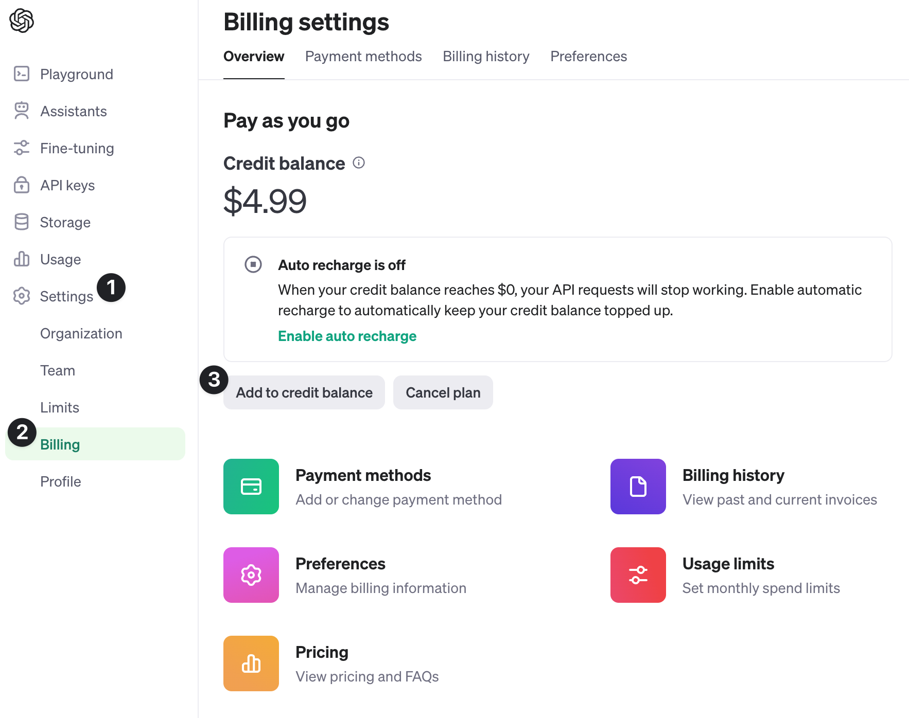
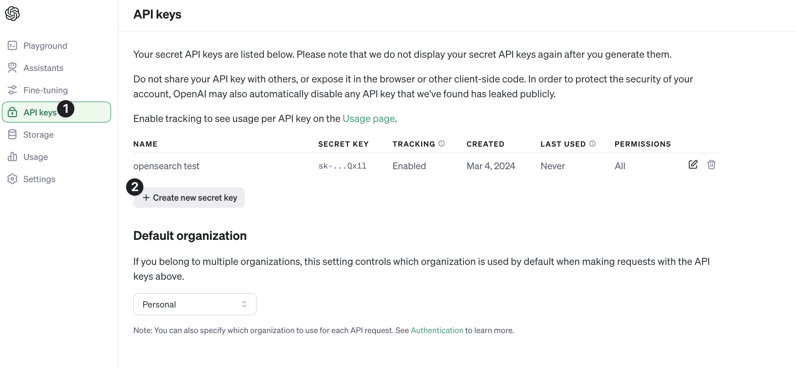
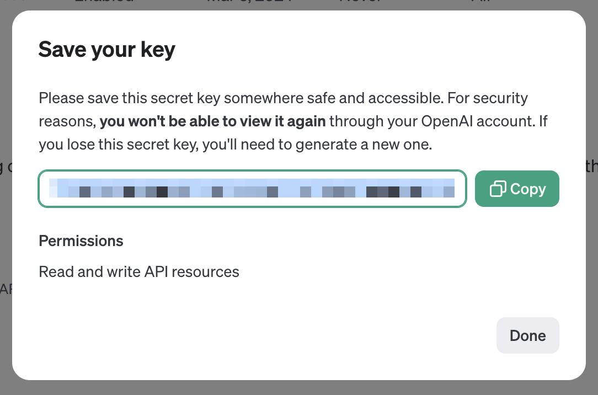

# Implementing a Retrieval Augmented Generation (RAG) pattern with OpenAI and OpenSearch

[](https://codespaces.new/aiven-labs/Opensearch-OpenAI-RAG-Pattern-with-Python)

This notebook demonstrates how to use semantic search to retrieve relevant information from a dataset using the OpenAI API and [Aiven for OpenSearch®](https://aiven.io/opensearch).

## Why using OpenSearch as backend vector database

OpenSearch is a widely adopted open source search/analytics engine. It allows to store, query and transform documents in a variety of shapes and provides fast and scalable functionalities to perform both accurate and [fuzzy text search](https://opensearch.org/docs/latest/query-dsl/term/fuzzy/). Using OpenSearch as vector database enables you to mix and match semantic and text search queries on top of a performant and scalable engine.

## Getting Started

This repo uses a jupyter notebook to walk through the process of creating an OpenSearch datastore in Aiven and searching against it using the OpenAI API.

### Setup your Aiven Account

You will need an [Aiven](https://aiven.io/) account. You can sign up for an account.


### Create an OpenSearch service

You can create an OpenSearch service in the Aiven console by selecting the OpenSearch service. You can choose the cloud provider and region you want to deploy the service in.

You can also create the service using the Aiven CLI.


### Add OpenAI Credits and Create an OpenAI API key

Our semantic search will be powered in-part by [OpenAI API](https://platform.openai.com/docs/oerview). In order to use the API, you will need to create an API key and purchase credits.

- Visit <https://platform.openai.com> and sign in or create an account
- On the left sidebar, select **Settings**, followed by **Billing**
- Select **Add to credit balance** (You will need to add a payment method)



Next, you will need to create an API key that will be used to authenticate your requests to the OpenAI API.

- In the sidebar, select **API keys** and then **Create new secret key**



- Give your key a name and select **All** for permissions. Select **Create secret key**
- Copy the key and store it in a safe place.

> !!! warning
> You will need it to authenticate your requests to the OpenAI API.



### [Option 1] Create a new codespace in GitHub

You can use the `code` button in the top right of the repo or the badge at the top of the readme to create a new codespace in GitHub. This will create a new environment with all the required dependencies to run the notebook.

You can select the image below to create a new codespace.

[](https://codespaces.new/aiven-labs/Opensearch-OpenAI-RAG-Pattern-with-Python)

### [Option 2] Setup the project locally

- fork the repo to your own GitHub account
- clone the repo to your local machine
- ensure Python is installed. You can download it from [python.org](https://www.python.org/downloads/) or use a package manager like [Homebrew](https://brew.sh/) on macOS, the Window Store on Windows, or your package manager of choice on Linux.
  ```shell
  python --version
  ```
- create a virtual environment based on your [operating system](https://docs.python.org/3/library/venv.html)
- install the dependencies

  You can install the python dependencies using pip.

  ```shell
  python -m pip install -r requirements.txt
  ```

### Follow the notebook

Follow the steps in [`notebook.ipynb` 🔗](./notebook.ipynb).
